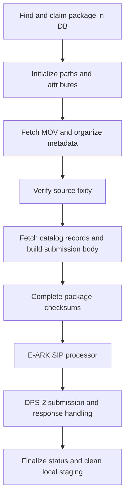

# Film → produksjon: proposed flow

Status: design for implementation together. No processors or database entries
have been created by this document. The scope is the viewing/production
derivative from the same historical production line as film → bevaring.

The reference is the [bevaring implementation](../../film_bevaring/README.md),
the supplied NiFi screenshots, and the
[captured produksjon package](../examples/sam-fs/digifilm_796646_20230321.notes.md).
Screenshots show the group layout and connections, but do not provide the DB
queries, processor properties, controller services, or full DPS contract.

## Proposed main path

The checksum preparation can live inside the E-ARK process group. It is shown
separately because catalog XML must be present before the final package
checksum manifest is completed. Preserve the distinction between verifying
the transferred media and hashing all files that will enter the SIP.

| Group | Responsibility | Reuse from bevaring |
|---|---|---|
| Find new package in DB | Select an eligible produksjon row and claim it once. Emit `prod_db_id`, `package.name`, and `package.path`. | Adapt the live DB group after inspecting its queries; they are not stored here. |
| Initialize | Validate package identity and source root; set isolated staging, payload, representation, and metadata paths. | Adapt the two [initialization scripts](../../film_bevaring/01_Initialize/). |
| Fetch and organize | Copy the loose MOV unchanged and retain all seven source XML files in their assigned locations. Build the expected-media inventory. | Reuse the staging approach and error conventions; write a smaller organizer for this layout. |
| Checksum | Hash the staged MOV and compare its path/identity, size, and digest with source metadata. Route missing, unexpected, ambiguous, or mismatching files to failure. | Reuse validation principles; replace the [DPX-specific verifier](../../film_bevaring/03_Checksum/). |
| Catalog / submission body | Look up the viewing-file URN, fetch its current catalog records, and build the DPS JSON body. | Adapt the screenshot's Catalog group and [submission-body scripts](../../film_bevaring/07_Submission%20body/). |
| E-ARK | Finish the checksum manifest after catalog retrieval, then call `EarkSIPGenerator` with the prepared paths and checksums. | Reuse the live processor configuration after checking its properties; adapt [checksum generation](../../film_bevaring/06_Generate%20checksums/). |
| DPS-2 | Create/reuse the submission, upload package files and events, and handle responses and retries. | Reuse the live DPS-2 and response-handling groups with produksjon-specific configuration. |
| Finalize / cleanup | Persist the result and a few monitoring fields, then remove eligible local staging files. | Simplify [finalization](../../film_bevaring/09_Finalize%20stats/) and adapt [cleanup](../../film_bevaring/10_Package%20cleanup/). |

For this example, omit DPX extraction, separate audio copying, RAWcooked,
batch management, compression statistics, and the scanner-specific creation
event extractor. Its audio is already inside the MOV. Other source layouts
should be identified explicitly before broadening the first implementation.

## Database preparation and pickup

The [package-discovery helper](../00_Package%20discovery/README.md) is available
for the first step: emit one FlowFile per
`produksjon/<year-month>/<package>` directory, with `package.name` and
`package.path`. It replaces the three-level bevaring listing for this layout.
The database insertion and subsequent DB pickup are separate steps.

Create the input rows before enabling pickup, as for bevaring. Start with the
single known example, then import a reviewed package-path list. There should
be one work item per canonical source package and flow, so rerunning the import
does not create duplicate jobs. Preserve the actual source path in the row's
`package_path` parameter and carry the row ID as `prod_db_id`.

Use the source root `/global/film/00/film/produksjon/` and an explicit flow
discriminator, proposed as `flow.id=film_produksjon`, in selection and reporting.
The exact DB field/parameter and eligible status must be chosen from the
existing schema and pickup queries. Bevaring reporting uses `Pline_id = 79`;
the shared historical production line does not by itself establish the new
transfer job's production-line ID or uniquely select these packages.

The claim operation must prevent two concurrent polls from taking the same
row. Reuse and check the existing claim/recovery mechanism. Store submission
identity so retrying an upload does not blindly create a second submission.
No bootstrap or pickup SQL is supplied until the current queries are known.

## Paths and package identity

Use flow-specific, configurable roots. Suggested values on nifi7:

| Attribute | Proposed value |
|---|---|
| `work.base.dir` | `/fc1/work/film_produksjon` |
| `payloads.base.dir` | `/fc1/payloads/film_produksjon` |
| `transfer.base.dir` | `/fc1/transfer/film_produksjon` |
| `source.dir` | Validated `package.path` from the DB |
| `rep.dir` | `<work.dir>/representations/primary_20230321` for this example |
| `rep.data.dir` | `<rep.dir>/data` |

Append the validated package name under each local root. This keeps cleanup
and concurrent flows separate. Retain the bevaring attribute names used by
reusable downstream components; remove DPX and RAWcooked-only attributes.

Bevaring's date matcher expects `_YYYYMMDD_`. This package ends in `_20230321`,
so the new initializer must also accept a terminal date and validate it.
Use a stable representation name on retries, not today's date. The package
date is a naming token; its actual historical derivation date is different.

Treat the package name as the candidate DPS `objectId`, subject to the selected
contract's identity rules. Use the actual viewing-file URN for catalog lookup;
do not substitute the related preservation/core-file URNs.

## Fixity and E-ARK handoff

The sample has a usable historical media MD5 in METS, JHOVE, and the MAVIS
carrier update, with matching file sizes. The
[metadata mapping](METADATA_MAPPING.md) records the exact values and bindings.

1. Copy the MOV into its final staged representation path.
2. Compute its MD5 from the copied bytes and compare with the expected digest
   and size. Record the verified digest against that relative path.
3. Fetch catalog XML and complete all metadata organization.
4. Hash the final metadata files and complete the package checksum manifest.
5. Pass that manifest to `EarkSIPGenerator` using the existing processor's
   checksum-input configuration, once confirmed.

The verified media digest can be reused in step 4 if that exact staged file
has remained unchanged. A successful copy or an imported historical checksum
alone is not a fixity check. Start with the existing checksum generator if
that is simpler; avoiding a second read of the large MOV is an optimization
that requires explicit tracking of the verified file.

Bevaring writes `checksums.md5` as `<md5> *<relative-path>` lines and exposes
`checksums.md5.path`. Its generator covers `metadata/` and `representations/`.
The processor properties are not in the screenshots, so confirm manifest
format, path base, algorithm, and metadata registration with the live E-ARK
configuration before wiring the new flow. The proposed layout is staging
input; `EarkSIPGenerator` produces the new SIP METS and other generated output.

## Events, completion, and failures

Keep the reusable [event appender](../../film_bevaring/Add%20event.groovy) and
the `transfer` and `information package creation` events. Adapt transfer text
to the MOV verification performed here; bevaring's current text mentions DPX.
Use actual event times and agent versions from the deployed processors.
The screenshot shows EarkSIPGenerator 1.0.10 while the checked-in event example
says 1.0.11, so neither should be blindly copied as the current version.

The legacy METS already records a 2023 `derivation` event. Preserve that source
history; this transfer does not perform a new derivation or RAWcooked migration.
Decide separately whether to map the historical event into the DPS event API.
Ensure event writes are complete before the DPS stage uploads them.

Keep submission acceptance, upload completion, and DPS preservation completion
as distinct states. Retain the existing asynchronous response/rollback handling
until its contract is understood. Final DB status and the local-cleanup trigger
must follow a confirmed durable completion condition, not an HTTP request alone.

Use one common failure route carrying `prod_db_id`, package identity,
`error.stage`, and `error.message`, with explicit retry/resume. Preserve enough
state to retry catalog or DPS work without recalling a successfully staged MOV.
Start with a bounded manual-review queue and backpressure; the custom two-slot
bevaring failure buffer can be added if needed. Set concurrency and queue limits
from staging capacity: even this single viewing file is about 206 GiB.
Cleanup operates only under this flow's local roots; source deletion remains
a separate operation.

## Minimal Grafana monitoring

Keep the existing DB model (`DIGITIZED_ITEM`, `DI_EVENT`, `DI_PARAMETER`) and
NiFi queue/error monitoring. Proposed minimum per package:

- Flow identity, source path, and current state, including failure stage/reason.
- `pipeline.start` and `pipeline.end` as epoch milliseconds; derive elapsed
  duration when querying rather than persisting every stage's timing.
- `package.size.end` in bytes, defined as staged package content covered by the
  checksum inventory. This is not necessarily the serialized SIP/archive size.
- Fixity result and DPS submission ID/status, which also support retry.

A small dashboard can show queued/running/failed/submitted/preserved counts,
completed packages per day, completed bytes per day, and package elapsed time.
Filter by the explicit produksjon cohort. Include pending and failed rows;
bevaring's completed-only view cannot provide queue and failure counts.
Count each package once so retries do not inflate totals. Show submission and
preservation counts separately if preservation confirmation is asynchronous.
Add fetch throughput or stage timings only if we later need them to diagnose
a bottleneck. RAWcooked and compression panels do not apply.

## Implementation order

1. Capture the existing DB bootstrap and pickup queries; define the produksjon
   cohort, eligibility state, and claim behavior. Prepare one package row.
2. Implement initialization, source-metadata parsing, and the staged file map
   against the captured example. Confirm the proposed metadata locations.
3. Implement copying and media verification on nifi7, keeping the real media
   off the development Mac. Test missing files and checksum mismatch with small
   synthetic files before the real package run.
4. Reuse catalog retrieval and submission-body construction, validating the
   viewing-file record and required metadata with a current catalog sample.
5. Wire the existing E-ARK and DPS-2 groups after confirming processor properties,
   contract/object identity, response handling, and cleanup conditions.
6. Add the small DB summary and Grafana view once state transitions are fixed.

The next missing input is the bevaring SQL for creating input rows and the
queries/properties inside **Find new package in DB**. The repository currently
contains reporting and metric-write SQL, not those queue/bootstrap queries.
